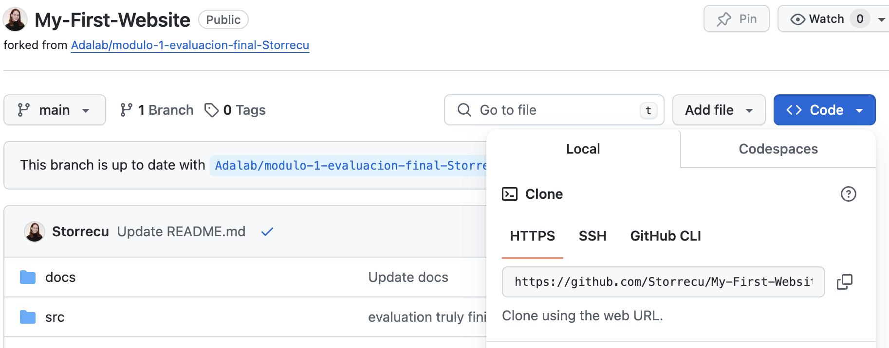

# Evaluación final módulo 1: Mi primera página web. :es:

Bienvenidos al **primero de muchos proyectos** que realizaré a lo largo de mi trayectoria como desarrolladora web. 

## Tech Stack. 
En este repositorio, encontraréis el primer proyecto realizado individualmente en el que trabajo en la réplica de un diseño ya dado, utilizando:
- HTML 
- CSS 
- Sass 
- Flexbox 
- CSS Grid 
- Media quieries
- Posicionamiento
- [Adalab Starter Kit](https://github.com/adalab/adalab-web-starter-kit)

## Detalles del proyecto y Interacciones a resolver. 
El objetivo es replicar una página web, orientada a la venta de material escolar de cara a la inminente vuelta al cole.
Las indicadiones para realizar el proyecto eran: 

1. Crear un botón tipo menú hamburguesa que quedase fijo en la parte superior izquierda y estuviese siempre presente al hacer scroll.Además esté botón debía tener enlace a la web principal de Adalab. 
2. Maquetar el primer módulo con flexbox y además añadir un botón que hiciese de link a la parte de "vuelta al cole" de la misma página. 
3. El segundo módulo debíamos maquetarlo usando las propiedades de CSS de nuestra preferencia. 
4. El tercer módulo debíamos maquetarlo con CSS Grid. 
5. Finalmente en el footer, debíamos maquetarlo usando flexbos y además, cada elemento de las 2 listas presentes debían tener un enlace a la web: https://adalab.es

Como puntos adicionales, añadí dos pseudo clases del tipo :hover para los botones de "Comprar" y "Empieza ahora".
Además, realicé una pequeña animación en el botón del footer para que haga una rotación de 360 grados al dejar el cursor encima. Este botón enlaza también a la web de Adalab. 

## Visualización del proyecto. 
Este proyecto está publicado en GitHub Pages, con lo cual, simplemente visitando el enlace que te dejo a continuación, puedes ver como funciona la página y cómo está creada.
En la parte superior derecha, en "About" encontrareis un enlaze que os llevará a la URL del proyecto terminado: https://storrecu.github.io/My-First-Website/ 

Sentíos libres de toquetear y de ver algunos efectos de transiciones y/o animaciones que he incluido. 

## Pasos para arrancar el proyecto

1. Clona el repositorio. Para ello, pulsa el botón azul: <>Code y copia la URL que aparece en lapestaña HTTPS.
   




2. Abre la terminal en tu equipo y ubicate la carpeta dónde guardarás el proyecto. Una vez situado, ejecuta el comando ``` git clone ``` seguida de la URL que has copiado anteriormente. 

3. Abre el proyecto en Visual Studio Code y ejecuta la terminal. A continuación, ejecuta los siguientes comandos:

   
   3.1. ``` npm instal ``` Con este comando, instalamos las dependencias del proyecto.

   
   3.2. Después ejecuta: ``` npm start ``` Con este comando podremos ver el proyecto en el navegador web.


## Contribución.
Si deseas contribuir a este proyecto, estoy abierta a sugerencias, feedbacks y mejoras.
Esta profesión requiere una formación constante, así que no seais tímidos. 


___


# Final Evaluation Module 1: My First Website. :gb:

Welcome to the **first of many projects** I will undertake throughout my journey as a web developer.

## Tech Stack.
In this repository, you will find the first project I have individually worked on, replicating a given design using:
- HTML
- CSS
- Sass
- Flexbox
- CSS Grid
- Media queries
- Positioning
- [Adalab Starter Kit](https://github.com/adalab/adalab-web-starter-kit)

## Project Details and Interactions to Solve.
The goal is to replicate a web page aimed at selling school supplies in preparation for the imminent back-to-school season.
The instructions for the project were:

1. Create a hamburger menu button that remains fixed in the top left corner and is always present when scrolling. Additionally, this button should link to the main Adalab website.
2. Layout the first module using flexbox and also add a button that links to the "back-to-school" section of the same page.
3. The second module should be laid out using CSS properties of our preference.
4. The third module should be laid out using CSS Grid.
5. Finally, in the footer, we should lay it out using flexbox, and additionally, each element of the 2 lists present should have a link to the website: [Adalab](https://adalab.es)

As additional points, I added two pseudo-classes of type :hover for the "Buy" and "Start now" buttons.
Additionally, I made a small animation on the footer button to rotate 360 degrees when hovering over it. This button also links to the Adalab website.

## Project Visualization.
This project is published on GitHub Pages, so simply by visiting the link I provide below, you can see how the page works and how it is structured.
At the top right, under "About," you will find a link that will take you to the URL of the finished project: [My First Website](https://storrecu.github.io/My-First-Website/)

Feel free to play around and see some transition effects and/or animations that I have included.

## Steps to Start the Project.

1. Clone the repository. To do this, click on the blue button: <>Code and copy the URL that appears in the HTTPS tab.
   


2. Open the terminal on your computer and navigate to the folder where you will save the project. Once there, execute the command ``` git clone ``` followed by the URL you copied earlier.

3. Open the project in Visual Studio Code and open the terminal. Then, run the following commands:

   
   3.1. ``` npm install ``` With this command, we install the project dependencies.

   
   3.2. Then run: ``` npm start ``` With this command, we can view the project in the web browser.

## Contribution.
If you wish to contribute to this project, I am open to suggestions, feedback, and improvements.
This profession requires constant learning, so don't be shy.


